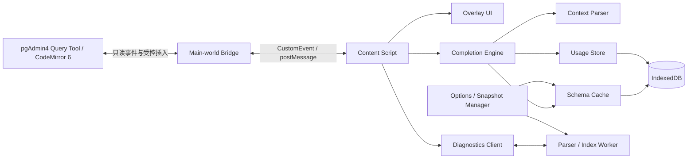

# PG4 Smart Assist — 开发实施规格（SPED）

> 状态：Draft for development
>
> 上游锚点：[Pre-SPEC.md](Pre-SPEC.md)。本文只细化实现、验收、测试和交付约束；若与前情提要冲突，以 `Pre-SPEC.md` 为准。
>
> 本规格将首发版本定义为可在企业线上 pgAdmin4 上安装、离线运行的浏览器扩展。它增强 Query Tool，但不修改 pgAdmin4、不会创建独立数据库连接，也不会替代原生执行和结果渲染。

---

## 1. 目标与范围

### 1.1 首发目标

交付一个 Chrome / Edge Manifest V3 扩展，在 pgAdmin4 v8.4 至 v9.x 的 Query Tool 中提供：

1. 离线 Schema 缓存驱动的上下文 SQL 补全。
2. 表别名、CTE、JSONB 键路径感知。
3. 基于本地频次、最近使用、主键/外键的候选排序。
4. 查询编辑中的语法和基础类型问题诊断。
5. 对象悬停文档、智能粘贴、JSONB 结构树、DDL 快照、片段库、历史检索和危险语句拦截。
6. 不向扩展外部网络、数据库服务或第三方分析服务发送 SQL、DDL、Schema、用户行为或凭据。

### 1.2 明确不在首发范围

- Firefox 正式支持；只保留可移植的浏览器 API 边界，不将其作为发布阻塞条件。
- 连接 PostgreSQL、读取数据库密码、保存 Cookie、注入或修改 pgAdmin4 后端。
- SQL 自动改写、性能调优建议、查询结果内容分析、云同步和多人协作。
- 对 pgAdmin4 v8.3 及以下或 CodeMirror 5 的兼容。
- 对任意未知 DDL 方言的完整 PostgreSQL 语义解析；首发只保证本规格列出的 `pg_dump --schema-only` 常见输出及自定义 JSONB 声明。

### 1.3 版本与浏览器矩阵

| 平台 | 首发承诺 | 最低版本 | 说明 |
|---|---:|---:|---|
| pgAdmin4 网页版 | 是 | v8.4 | CodeMirror 6；适配 v8.4 至 v9.x |
| Chrome | 是 | 当前企业受管版本 | Manifest V3 |
| Microsoft Edge | 是 | 当前企业受管版本 | Chromium 内核，复用 Chrome 构建 |
| Firefox | 否 | - | 后续根据 WebExtension API 差异单独验证 |

---

## 2. 产品行为与验收边界

### 2.1 与 pgAdmin4 的关系

扩展只能以渐进增强方式工作：

- 不替换 CodeMirror 编辑器、原生补全、执行按钮、执行逻辑、结果网格或连接管理。
- 不阻止原生键盘事件，除非用户正在操作本扩展打开的候选菜单或确认框。
- 无活跃 Schema、DDL 导入失败、编辑器识别失败或扩展发生异常时，必须静默降级；原生 pgAdmin4 仍可正常编辑和执行。
- 所有页面读取均为只读。危险操作中的 `EXPLAIN` 只能借助用户已登录 pgAdmin4 的既有查询通道触发，且必须先获得用户确认。

### 2.2 数据安全

| 数据类别 | 存储位置 | 是否离开浏览器 |
|---|---|---:|
| DDL 原文与解析后的 Schema | 本机 IndexedDB | 否 |
| SQL 查询历史、候选使用频次、最近使用记录 | 本机 IndexedDB | 否 |
| 片段、插件设置、活跃环境引用 | `chrome.storage.local` 或 IndexedDB | 否 |
| 当前页面 SQL / 光标信息 | 内存 | 否 |
| pgAdmin4 Cookie、登录 Token、数据库密码 | 不读取、不持久化 | 否 |

扩展不得申请 `<all_urls>`、`cookies`、`webRequest`、`management`、`history` 或任何不必要的浏览器权限。安装时由用户显式授权允许注入的 pgAdmin4 Host。

### 2.3 基础性能预算

| 操作 | 目标 | 约束 |
|---|---:|---|
| 键入后候选首帧 | P95 ≤ 50ms | 不触发网络或数据库查询 |
| 上下文增量解析 | P95 ≤ 10ms | 单次编辑，500 KB SQL 以内 |
| 候选排序 | P95 ≤ 10ms | 候选集最多 2,000 项后再截断 |
| 语法诊断可见 | 输入结束后 < 1s | 300ms debounce；运行在 Worker |
| 50 MB DDL 导入 | 可交互且不中断页面 | Worker 分块解析并显示进度 |
| 活跃 Schema 切换 | ≤ 200ms | 已解析索引直接切换，不重新解析 DDL |

---

## 3. 技术架构

### 3.1 固定技术决策

| 层 | 技术决策 | 原因 |
|---|---|---|
| 扩展格式 | Manifest V3 | Chrome / Edge 当前分发标准 |
| 语言 | TypeScript（严格模式） | AST、索引和跨层消息需要类型约束 |
| 构建 | Vite + CRXJS（或同等 MV3 打包器） | 可生成 service worker、content script、options page |
| 页面注入 | `content_scripts` + `world: MAIN` 桥接脚本 | 访问 CodeMirror 6 页面对象，同时隔离扩展逻辑 |
| 解析与索引 | Web Worker | 保护 Query Tool 输入响应 |
| 大数据本地存储 | IndexedDB | 适合多版本 DDL、历史和索引 |
| 小配置 | `chrome.storage.local` | 适合 host allowlist、主题和活跃快照 |
| UI | 原生 Web Components 或轻量组件层 | 不影响宿主页面 CSS，避免替换 pgAdmin UI |

实现可更换具体库，但不得改变安全边界、离线优先原则或本节定义的模块职责。

### 3.2 模块职责



| 模块 | 必须职责 | 禁止职责 |
|---|---|---|
| Main-world Bridge | 发现编辑器、读取文档和光标、监听输入、执行一次受控编辑、将编辑器事件转发 | 存储 DDL、解析 SQL、调用网络接口 |
| Content Script | 宿主页生命周期、补全触发、浮层定位、与 Worker/存储通信 | 持久化页面对象、覆盖原生 Query Tool 行为 |
| Completion Engine | 结合上下文、Schema、频次返回候选与替换范围 | 查询数据库、依赖网络 |
| Context Parser | 解析光标前最小 SQL 范围、推导别名/CTE/补全槽位 | 执行 SQL 或产生写入 |
| Parser / Index Worker | DDL 解析、Schema 索引、诊断、Diff | 直接操作 DOM |
| Snapshot Manager | 导入、命名、校验、切换、导出、删除快照 | 自动上传数据 |
| Options UI | 设置 Host、快照、片段、历史与隐私控制 | 访问未授权站点 |

### 3.3 消息协议

所有跨 world 和跨线程消息必须有 `version`、`requestId`、`type` 和经过校验的 payload。页面内容视为不可信输入。

```ts
type BridgeMessage =
  | { version: 1; requestId: string; type: 'editor-ready'; editorId: string }
  | { version: 1; requestId: string; type: 'editor-state'; editorId: string; sql: string; cursor: number; selection: { from: number; to: number } }
  | { version: 1; requestId: string; type: 'editor-change'; editorId: string; sql: string; cursor: number; transactionKind: 'input' | 'paste' | 'selection' }
  | { version: 1; requestId: string; type: 'apply-completion'; editorId: string; from: number; to: number; insert: string }
  | { version: 1; requestId: string; type: 'bridge-error'; code: string; detail?: string };
```

桥接层必须拒绝来自非扩展 nonce 的写入类消息，并限制单条 SQL / DDL 消息长度，防止恶意页面事件造成资源耗尽。

---

## 4. pgAdmin4 与 CodeMirror 6 适配

### 4.1 编辑器发现

1. Content script 在 `document_idle` 注入，且仅在已授权 Host 运行。
2. 使用 `MutationObserver` 监听 Query Tool tab、编辑器 DOM 和 tab 激活变化。
3. Main-world bridge 在页面对象和 DOM 中寻找 CodeMirror 6 `EditorView` 的可达实例；适配器不得假定单一固定 CSS 类名。
4. 必须支持同一 pgAdmin 窗口多个 Query Tool tab，并以 `editorId` 区分状态。
5. 不可发现编辑器时，记录匿名本地诊断事件并停止重试；新 tab / DOM 变化再触发一次发现。

### 4.2 最小编辑器能力接口

适配器对其他模块只暴露以下接口：

```ts
interface QueryEditorAdapter {
  readonly editorId: string;
  getDocument(): string;
  getCursorOffset(): number;
  getSelection(): { from: number; to: number };
  replaceRange(from: number, to: number, insert: string): void;
  getCoordinates(offset: number): DOMRect | null;
  onChange(listener: (state: EditorStateSnapshot) => void): () => void;
  onFocus(listener: () => void): () => void;
  destroy(): void;
}
```

`replaceRange` 必须经过 CodeMirror transaction dispatch，以保留 Undo/Redo、历史栈和原生事件；禁止直接写 `contenteditable.innerText` 或 DOM 节点。

### 4.3 兼容性探针（实现前阻塞项）

在开始功能开发前，必须对目标 pgAdmin4 v8.4、当前公司生产版本和最新 v9.x 各执行一次探针：

- 编辑器实例是否可读取文档和选择区。
- 是否可通过 transaction 正确插入、撤销和重做。
- Query Tool 切换 tab 后旧实例是否释放。
- 原生补全打开时本扩展候选的叠层是否正常。
- 结果 grid、弹窗和侧边栏变化是否会误识别为编辑器。

探针失败时，记录版本、DOM 特征和失败原因；不得以轮询 DOM 文本的方式替代可编辑器实例接口而继续开发实时校验。

---

## 5. 数据模型与离线 Schema

### 5.1 快照生命周期

1. 用户在 Options / 管理面板创建快照，填写环境名称、可选数据库标签和颜色。
2. 用户选择一个 `pg_dump --schema-only` 文件上传。
3. 扩展在 Worker 中解析 DDL，显示进度与结构化错误。
4. 解析成功后写入 IndexedDB；原始 DDL 与标准化 Schema Graph 绑定到不可变 `snapshotId`。
5. 用户可为已授权 pgAdmin Host 选择一个活跃快照；切换不影响其他快照。
6. 用户可比较任意两个快照、导出快照包或永久删除快照。

导入失败不得覆盖原有快照。任何快照被删除前必须提示是否一并删除其本地使用频次和历史关联。

### 5.2 Schema Graph

```ts
type SchemaGraph = {
  snapshotId: string;
  displayName: string;
  sourceFileName: string;
  importedAt: string;
  parserVersion: number;
  schemas: Record<string, SchemaNode>;
  functions: FunctionNode[];
};

type TableNode = {
  kind: 'table' | 'view' | 'materialized-view' | 'foreign-table';
  schema: string;
  name: string;
  quoted: boolean;
  comment?: string;
  columns: ColumnNode[];
  primaryKey: string[];
  foreignKeys: ForeignKeyNode[];
  indexes: IndexNode[];
};

type ColumnNode = {
  name: string;
  quoted: boolean;
  dataType: string;
  nullable: boolean;
  defaultExpression?: string;
  comment?: string;
  ordinal: number;
  isPrimaryKey: boolean;
  foreignKey?: ForeignKeyNode;
  jsonbPaths?: JsonbPathNode[];
};

type JsonbPathNode = {
  segments: string[];
  displayPath: string;
  valueType?: string;
  nullable?: boolean;
  comment?: string;
  children: JsonbPathNode[];
};
```

标识符必须同时保存原始大小写、规范化查询键和是否带引号。未加双引号的 PostgreSQL 标识符按小写进行匹配；带双引号的标识符仅精确匹配。

### 5.3 DDL 支持范围

首发 DDL parser 必须识别：

- `CREATE SCHEMA`。
- `CREATE TABLE`，含列、类型、`NOT NULL`、`DEFAULT`、主键、唯一键和外键。
- `ALTER TABLE ... ADD CONSTRAINT`。
- `CREATE VIEW`、`CREATE MATERIALIZED VIEW`、`CREATE FOREIGN TABLE` 的对象名称。
- `COMMENT ON TABLE`、`COMMENT ON COLUMN`。
- `CREATE [OR REPLACE] FUNCTION` 的函数名、参数和返回类型。
- `CREATE INDEX` 的索引列，用于补全排序权重和悬停说明。

不能可靠解析的语句必须被收集为 warning（带行号和原文摘要）；只有影响 Schema Graph 一致性的致命错误才阻止快照创建。

### 5.4 JSONB Field 声明格式

为了不依赖结果集采样，DDL 文件用单行 SQL 注释定义 JSONB 路径。首发正式语法如下：

```sql
-- @pg4-jsonb public.orders.payload customer.id:uuid "Customer identifier"
-- @pg4-jsonb public.orders.payload customer.profile.name:text
-- @pg4-jsonb public.orders.payload items[].sku:text
-- @pg4-jsonb public.orders.payload items[].quantity:integer
```

规则：

- 格式为 `-- @pg4-jsonb <schema>.<table>.<column> <path>:<type> ["comment"]`。
- `<path>` 使用 `.` 分段；`[]` 表示数组元素；键名含 `.`、空格或特殊字符时用 JSON Pointer 转义形式 `/key/with~1slash`。
- `<type>` 可省略，省略时标记 `unknown`；允许 PostgreSQL 常用标量名和 `jsonb`。
- 目标列不存在或不是 `json/jsonb` 时产生 warning，不阻塞导入。
- 同一路径重复声明时，最后一条覆盖类型与注释，保留 warning。

上述格式是实现层正式约定。若用户已有固定 JSONB 描述格式，须在开始 parser 实现前提供样例，并以兼容解析器方式扩展，不能静默改变既有文件。

### 5.5 IndexedDB object stores

| Store | Key | 内容 |
|---|---|---|
| `snapshots` | `snapshotId` | 快照元数据与原始 DDL 压缩内容 |
| `schemaGraphs` | `snapshotId` | 标准化 Schema Graph 与检索索引 |
| `hostBindings` | `origin` | Host 到活跃 `snapshotId` 的绑定 |
| `usage` | `snapshotId + symbolKey` | 频次、最近使用、局部热度 |
| `queryHistory` | 自增 ID | SQL、时间、快照、可选数据库标签 |
| `snippets` | `snippetId` | 分类、正文、变量定义、使用记录 |
| `settings` | `key` | 保留给不能放入 `chrome.storage` 的设置 |

默认配额保护：历史最多 20,000 条或 100 MB，以先过期最旧记录为准；DDL 原文和索引最大总量 250 MB，达到上限时禁止新导入并指导用户删除旧快照。

---

## 6. SQL 上下文解析与补全

### 6.1 解析策略

补全不要求执行完整 PostgreSQL parser。每次输入只解析当前语句和光标附近 token，并维护可增量更新的局部分析结果：

1. 分割 SQL，忽略字符串、注释和 dollar-quoted function body 内的关键字。
2. 找出包含光标的语句与嵌套层级。
3. 识别最外层和当前子查询范围中的 `WITH`、`SELECT`、`FROM`、`JOIN`、`WHERE`、`GROUP BY`、`ORDER BY`、`INSERT`、`UPDATE`、`DELETE`、`VALUES`、`RETURNING`。
4. 建立 relation map：表、视图、CTE、子查询投影与别名。
5. 以光标前 token 和 relation map 推导 `CompletionContext`。

解析器必须容错：不完整 SQL、未闭合括号、未闭合引号或用户正在输入的关键字不得抛出到 UI。

### 6.2 CompletionContext

```ts
type CompletionContextKind =
  | 'relation'
  | 'schema'
  | 'column'
  | 'qualified-column'
  | 'function'
  | 'keyword'
  | 'cte-name'
  | 'jsonb-path'
  | 'insert-column'
  | 'insert-value'
  | 'type'
  | 'unknown';

type CompletionContext = {
  kind: CompletionContextKind;
  from: number;
  to: number;
  prefix: string;
  activeAlias?: string;
  activeRelation?: RelationRef;
  visibleRelations: RelationRef[];
  expectedTypes?: string[];
  jsonb?: { relation: RelationRef; column: string; operator: '->' | '->>' | '#>' | '#>>' };
};
```

### 6.3 上下文规则

| 光标位置或前导 token | 候选类型 | 关键限制 |
|---|---|---|
| `FROM`、`JOIN`、`UPDATE`、`INTO` 后 | schema、表、视图、CTE | 不显示列和普通函数 |
| `schema.` 后 | 该 schema 的 relation | 不显示其他 schema 对象 |
| `SELECT`、`WHERE`、`ON`、`GROUP BY`、`ORDER BY`、`HAVING` | 可见 relation 的列、别名、函数、关键字 | 列优先；仅在语义合理时显示 relation |
| `alias.` / `table.` 后 | 对应 relation 的列 | 只显示该 relation；CTE 同样适用 |
| `INSERT INTO table (` | 目标表列 | 优先未出现列；主键/默认列降低权重 |
| `VALUES (` | 字面量片段、函数 | 根据目标列类型排序 |
| `WITH name AS (` | 可用关键字和 relation | CTE 名在闭合后加入当前作用域 |
| `jsonColumn ->` / `->>` / `#>` / `#>>` | 此 JSONB 列的路径或下一层 key | 仅来自当前快照 JSONB 索引 |
| 函数参数内 | 函数、列、字面量片段 | 可按已知函数签名过滤 |

当上下文不确定时，显示经过降噪的通用候选：关键词、当前作用域列和高频函数；不得展示全库所有列。

### 6.4 别名、CTE、子查询

- `FROM public.orders o`、`JOIN public.customer AS c` 需建立别名。
- `WITH recent AS (...) SELECT recent.` 必须提供 CTE 投影列；`SELECT *` 的 CTE 投影可继承其明确来源 relation 的列，无法推导时保守地不展示列并显示 CTE 名。
- 子查询 `FROM (SELECT id, name FROM ...) x` 必须提取显式 select-list 名称与 `AS` 别名。
- 名称遮蔽按最近嵌套作用域优先。
- 不要求推导 `SELECT *` 与 `NATURAL JOIN` 的完整列集合；这类情况的补全可以退化，但不得给出明显错误的关系列。

### 6.5 候选与排序

```ts
type CompletionItem = {
  kind: 'table' | 'view' | 'column' | 'function' | 'keyword' | 'snippet' | 'jsonb-path' | 'cte';
  label: string;
  detail?: string;
  documentation?: string;
  insertText: string;
  filterText: string;
  score: number;
  source: 'schema' | 'builtin' | 'snippet' | 'usage';
};
```

排序分数为：

$$S = 0.40M + 0.20R + 0.15F + 0.10L + 0.10K + 0.05D$$

其中：

- $M$：前缀匹配分（精确前缀 > camel/word boundary > fuzzy）。
- $R$：最近使用衰减分，30 天线性衰减至 0。
- $F$：该符号全局使用频率归一化分。
- $L$：当前 SQL 文档 / 当前 Query Tool 会话局部使用频率。
- $K$：关系关键性，主键、外键、目标表字段或当前 JOIN 条件涉及的字段加分。
- $D$：上下文匹配与类型匹配分。

同分按种类优先级（上下文最相关者优先）和稳定字母序决胜。首次使用没有历史数据时，只使用 $M + K + D$，不可产生随机排序。

### 6.6 补全交互

- 默认在输入两个可补全字符后触发；`.`、`->`、`->>`、`#>`、`#>>` 可立即触发。
- `Ctrl+Space` / `Cmd+Space` 必须强制触发；在 macOS 下若被系统占用，允许在设置中配置替代快捷键。
- 候选菜单最多初始渲染 50 项；继续输入后重新过滤。
- `Enter`、`Tab`、鼠标点击确认；`Escape` 关闭并不影响原生编辑器。
- 选择候选后以 CodeMirror transaction 替换 `[from, to)`；记录选择行为但不记录完整 SQL。
- 当 pgAdmin4 原生补全菜单已经打开，默认显示本扩展菜单；设置中可改为仅手动触发，避免两层候选冲突。

---

## 7. P1 编辑增强

### 7.1 智能粘贴包裹

触发条件：用户在 Query Tool 中粘贴纯文本、无换行、长度不超过 256 字符且内容未带单引号或双引号。

| 上下文 | 行为 |
|---|---|
| `WHERE text_column = <cursor>`、`VALUES` 中的 text / uuid / date 列 | 插入单引号并按 PostgreSQL 规则转义内部 `'` |
| 标识符槽位（如 `SELECT <cursor>` 且剪贴板为列名） | 只在包含大写、空格或特殊字符时加双引号 |
| 数字 / boolean 列值 | 不加引号 |
| 已在字符串、注释、dollar quote 内 | 不改写 |
| 类型不明或粘贴含 SQL 片段 / 换行 | 不改写 |

首次触发时显示一次可关闭的提示；设置页支持完全关闭、只提示不自动包裹和恢复默认。

### 7.2 实时诊断

诊断分两类：

- 红色：词法或结构性语法问题，例如未闭合引号、括号失衡、关键子句顺序明显错误、无法识别的局部 token。
- 黄色：基于 Schema Graph 的静态类型风险，例如 `integer_column = 'abc'`、明显不存在的 `alias.column`、`INSERT` 列数与 `VALUES` 数量不一致。

要求：

- 仅在 300ms 无输入后运行；文档大于 500 KB 时只诊断光标所在语句。
- 所有诊断必须可点击说明，并可一键忽略当前规则。
- 不得把 PostgreSQL 可隐式转换的常见合法表达式误报为红色；类型不确定时宁可不提示。
- 渲染使用独立 overlay decoration，不重写 CodeMirror lint 插件或 pgAdmin4 原生 decorations。

### 7.3 对象悬停文档

悬停 relation 或 column 超过 350ms 后显示可关闭浮层：

- 完整限定名；
- 类型、可空性、默认值、注释；
- 主键 / 唯一键 / 外键关系；
- 对 JSONB 列显示已声明的根路径数量。

未知或 SQL 中不可唯一解析的名称不显示误导性的文档。浮层必须有 150ms 离开延迟，避免用户从 token 移到浮层时闪烁。

### 7.4 JSONB 结果区域复制

该功能仅在可以可靠识别 pgAdmin4 结果 grid 中 JSON/JSONB 单元格时启用：

- 选中 JSON 区域后，复制原始紧凑 JSON 子值，不包含界面格式化缩进。
- 无法确认原始值边界时，保留 pgAdmin4 原生复制行为。
- 首发需以目标 pgAdmin4 版本的实际结果 grid 探针为前置条件；若无法稳定获取单元格原始值，此功能延后，不允许通过屏幕文本猜测 JSON 结构。

---

## 8. P2 信息可视化

### 8.1 JSONB 结构树

- 入口：JSONB 列补全菜单的 “Browse JSONB paths” 项，以及对象悬停浮层。
- 以可展开树展示 `JsonbPathNode`；数组节点显示 `[]`。
- 点击叶子节点插入：
  - 单级文本：`->>'key'`；
  - 多级文本：`#>>'{parent,child}'`；
  - 需 JSON 结果时：`->` / `#>`。
- 插入前判断当前 token 是否已含操作符；若有，只替换路径部分，不能重复插入操作符。

### 8.2 DDL 快照对比

- 用户从任意两个同类快照选择 A / B。
- Diff 以 schema / relation / column / constraint / function 为结构化层级；原始 DDL diff 作为第二视图。
- 变更标记：新增、删除、重命名候选、类型/可空/默认值/注释/约束变化。
- “重命名候选”只在同 schema 且结构相似度达到 0.85 时展示，必须标记为推测，不能当作事实。
- Diff 只在本地 Worker 运行，结果不上传。

---

## 9. P3 效率与安全

### 9.1 片段库

片段包含名称、分类、正文、描述、变量与使用统计：

```ts
type Snippet = {
  id: string;
  title: string;
  category: string;
  body: string;
  description?: string;
  variables: Array<{ name: string; defaultValue?: string; required: boolean }>;
  updatedAt: string;
};
```

- 支持 `${name}` 变量；展开后按变量顺序进入内联编辑或小型表单。
- 补全中以 `snip:` 前缀检索，或通过配置快捷键打开。
- 禁止自动执行片段；插入仍由用户确认。

### 9.2 查询历史

- 只在用户执行 Query Tool 语句后记录；执行行为通过只读页面事件或稳定 DOM 状态识别。
- 保存 SQL、时间、活跃快照 ID、可选手工标签；不读取或保存数据库密码/会话 token。
- 提供全文关键词、时间范围、快照和标签筛选。
- 复用历史需要显式点击或确认，避免误覆盖当前未保存 SQL。

### 9.3 危险语句拦截

识别以下语句：

- `DELETE` 或 `UPDATE` 没有有效 `WHERE`。
- `WHERE 1=1`、`WHERE TRUE`、`WHERE 'x' = 'x'` 等恒真条件。
- `TRUNCATE`、`DROP TABLE`、`DROP SCHEMA`、`DROP DATABASE`、`ALTER TABLE ... DROP COLUMN`。

交互规则：

1. 用户点击原生执行前，扩展显示二次确认层，内容包括语句类别、目标对象和风险原因。
2. 用户可取消，取消时不吞掉后续正常编辑事件。
3. 若用户选择 “预估影响行数”，扩展仅通过已验证的 pgAdmin4 查询通道提交 `EXPLAIN <statement>`；不得使用独立连接。
4. `EXPLAIN` 失败、目标是 DDL、或当前 pgAdmin4 版本无法可靠调用既有通道时，显示“无法预估”，而非执行原语句。
5. 用户确认后只放行原来的用户操作；扩展不构造和执行实际 DML / DDL。

此功能需默认开启，但可按 host 关闭。对事务中的批量脚本，仅在能定位即将执行的语句时拦截，否则提示覆盖范围而不承诺逐条判断。

---

## 10. UI 与可访问性

- 所有 overlay 使用 Shadow DOM 或前缀化 class，避免被 pgAdmin4 CSS 覆盖。
- 颜色需同时表达状态和文字 / 图标，不能仅以红黄区分诊断。
- 候选菜单实现键盘方向键、PageUp/PageDown、Enter、Tab、Escape 和 ARIA combobox/listbox 语义。
- 浮层、确认框和设置面板必须可用键盘关闭并恢复编辑器焦点。
- 跟随 pgAdmin4 明暗主题；无法识别时使用系统主题。
- 不创建大幅 marketing / landing 页面；插件弹窗只提供当前状态、快照切换、快捷入口和隐私状态。

---

## 11. 权限、部署与设置

### 11.1 Manifest 最小权限

```json
{
  "manifest_version": 3,
  "name": "PG4 Smart Assist",
  "permissions": ["storage", "scripting"],
  "optional_host_permissions": ["https://*/"],
  "background": { "service_worker": "service-worker.js", "type": "module" }
}
```

实际发布前必须将 `optional_host_permissions` 收紧为公司允许的 pgAdmin4 域名模式；不得以 `https://*/` 作为生产正式包的最终配置。用户须从设置页添加并授权具体 origin。

### 11.2 企业分发

- 首选 Chrome / Edge Enterprise Policy 私有分发，使用企业统一签名与更新地址。
- 开发和试点通过 unpacked extension 或受控测试渠道安装。
- 发布包需提供版本、变更说明、SHA-256 和最小权限说明。
- 升级后若 IndexedDB schema migration 失败，保留旧数据、禁用对应功能并提供本地导出诊断包；不得静默清空 DDL 和历史。

### 11.3 设置页

必须包含：

- 已授权 pgAdmin origin 管理；
- 快照导入、导出、删除、活跃快照绑定；
- JSONB annotation 格式提示；
- 补全触发方式、候选数量、快捷键；
- 智能粘贴、诊断、危险操作拦截的开关；
- 历史保留上限与一键清除；
- 本地数据大小统计和全量导出；
- 隐私说明：不上传、不保存凭据、所有数据保存在本机浏览器。

---

## 12. 开发阶段与交付物

### Phase 0：兼容性 Spike

**目标**：验证真实线上 pgAdmin4 的 CodeMirror 6 访问方式和页面生命周期。

交付物：

- 各目标版本的探针报告。
- `QueryEditorAdapter` 最小样例：读取 SQL、读取光标、通过 transaction 插入、Undo/Redo 正常。
- 已知 DOM / 编辑器差异表。

退出标准：v8.4、公司生产版本和 v9.x 中至少各一套测试环境能完成最小接口；否则先调整适配策略，不开始业务功能。

### Phase 1：Schema 基础与 P0 补全

**目标**：完成离线快照、索引、上下文补全和候选排序。

交付物：

- DDL import Worker、Schema Graph、IndexedDB migration。
- JSONB annotation 解析和结构树索引。
- `FROM/JOIN` relation、`alias.` column、CTE、JSONB path 和关键词/函数补全。
- P95 50ms 性能基准报告。

退出标准：P0 验收用例全部通过，且没有来自补全路径的网络请求。

### Phase 2：P1 编辑增强

**目标**：诊断、粘贴、对象文档与经探针验证的 JSONB 复制。

交付物：

- 语法 / 类型诊断 Worker 与 overlay。
- 智能粘贴和对象 hover。
- JSONB 结果复制可行性结论与实现（若探针通过）。

退出标准：诊断在 1s 内可见，且对常见合法 PostgreSQL 写法无阻塞性误报。

### Phase 3：P2/P3 与企业发布

**目标**：完成信息可视化、效率和风险保护，打包试点版本。

交付物：

- JSONB tree、快照 Diff、片段和历史检索。
- 危险操作确认及受控 EXPLAIN 预估。
- 企业安装包、权限审计、隐私审计、运行手册和回滚方案。

退出标准：试点用户完成核心场景，插件禁用或卸载后 pgAdmin4 行为无变化。

---

## 13. 测试策略

### 13.1 单元测试

覆盖：

- SQL tokenizer：注释、单/双引号、dollar quote、嵌套括号、多语句。
- Context Parser：SELECT / FROM / JOIN / WHERE / ORDER BY / INSERT / CTE / subquery / alias。
- DDL Parser：表、列、constraint、comment、function、quoted identifier、JSONB annotation。
- 排序：无历史冷启动、频率、最近使用、主键/外键和稳定 tie-break。
- JSONB 路径到 `->>` / `#>>` 插入文本。
- 识别危险语句的正例、反例和注释/字符串干扰。

### 13.2 集成测试

使用 Playwright 在固定 pgAdmin4 fixture 环境执行：

- Query Tool 打开 / 关闭 / 切换 tab。
- 补全菜单定位、键盘选择、插入、撤销与重做。
- schema 切换后候选立即变化。
- 原生补全存在时的冲突行为。
- 窗口缩放、深浅主题和高 DPI。
- 可访问性：键盘路径和 ARIA 基础检查。

### 13.3 性能测试

基准数据至少包含：

| 数据集 | 规模 |
|---|---:|
| 小型 | 20 tables / 300 columns |
| 中型 | 500 tables / 8,000 columns |
| 大型 | 2,000 tables / 40,000 columns / 50 MB DDL |

在中型数据集上测量 1,000 次随机补全；报告 P50、P95、P99、候选数、内存占用和主线程长任务。P95 超过 50ms 不可进入试点。

### 13.4 回归兼容

每次 pgAdmin4 小版本升级至少验证：编辑器发现、补全插入、Undo/Redo、Query Tool 多 tab、危险操作拦截开关和扩展禁用后的原生行为。

---

## 14. P0 验收用例

| 编号 | 前置 | 操作 | 期望 |
|---|---|---|---|
| AC-01 | 活跃快照含 `public.orders` | 输入 `SELECT * FROM pub` | 仅候选 `public` schema / relation，不显示列 |
| AC-02 | `orders` 含 `id`, `customer_id` | 输入 `SELECT o. FROM public.orders o` | 仅展示 `orders` 列，优先 `id`、`customer_id` |
| AC-03 | CTE 显式投影 `id`, `name` | 输入 `WITH x AS (...) SELECT x.` | 仅展示 `id`, `name` |
| AC-04 | `payload` 有 JSONB annotations | 输入 `o.payload ->>` | 展示该列可用路径，不展示其他 JSONB 列路径 |
| AC-05 | 无快照 | 输入 SQL 并触发补全 | 提供关键词/内置函数，不报错、不请求网络 |
| AC-06 | 有候选菜单 | 用 Tab 选择候选，随后 Ctrl+Z | 仅替换范围正确，Undo 恢复原文本 |
| AC-07 | 常用字段已多次选择 | 再次输入相同前缀 | 在同样上下文下该字段排名提高且排序稳定 |
| AC-08 | 复杂不完整 SQL | 输入未闭合括号或字符串 | 补全和编辑器继续可用，无未捕获错误 |
| AC-09 | 中型快照 | 随机 1,000 次补全 | P95 候选首帧 ≤ 50ms |
| AC-10 | 扩展被禁用 | 使用 Query Tool | pgAdmin4 原生编辑、执行和结果无差异 |

---

## 15. 风险与处理策略

| 风险 | 影响 | 处理 |
|---|---|---|
| pgAdmin4 私有 DOM / 编辑器实例在升级后变化 | 编辑器无法接入 | 先完成 Phase 0 探针；适配器隔离；版本回归测试 |
| DDL parser 不能覆盖全部 PostgreSQL 语法 | Schema 不完整 | 可恢复 warning；明确支持子集；保留原始 DDL 和行号 |
| SQL 上下文解析误判 | 候选噪音或错误 | 局部、保守解析；不确定时降级；测试真实查询 corpus |
| 大型快照占用空间 / 主线程卡顿 | 浏览器体验差 | Worker、分块索引、配额和快照总量限制 |
| 原生补全菜单冲突 | 用户体验混乱 | 默认本扩展优先；提供手动模式与快捷键；不拦截 Escape |
| 危险操作拦截错误阻断 | 影响业务操作 | 仅做确认层；始终可取消或按 host 关闭；不直接执行 SQL |
| 浏览器企业策略限制扩展 | 无法部署 | 早期与 IT / Security 确认签名、allowlist、更新策略 |

---

## 16. 开发前待确认事项

以下问题不会改变上游定稿的产品边界，但会影响实施排期和测试环境；在 Phase 0 结束前必须确认：

1. 公司线上 pgAdmin4 的准确版本、访问 origin，以及是否存在反向代理路径前缀。
2. 企业允许的扩展安装方式：Edge/Chrome Enterprise Policy、私有商店还是手工加载。
3. 是否有可供自动化测试的脱敏 pgAdmin4 环境和 DDL 样例；真实生产数据不得用于自动化测试。
4. JSONB Field 定义是否已有现行格式。若有，需提供至少一个含数组和嵌套路径的匿名样例，以决定是否采用或兼容 `@pg4-jsonb` 格式。
5. 危险语句的确认层是否允许拦截原生执行点击；若企业策略不允许，则降级为执行前静态风险提示，不承诺阻止执行。
6. 查询历史的本机保留期限与容量是否有公司合规要求。

---

## 17. Definition of Done

版本可进入企业试点，必须同时满足：

- P0 全部验收用例通过，且中型快照下补全 P95 不超过 50ms。
- 已在 pgAdmin4 v8.4、公司生产版本和一个 v9.x 环境完成编辑器探针与回归。
- 未发现 SQL / DDL / Schema / 历史向外发送的网络请求。
- Manifest 权限经安全审查，仅保留本规格允许的最小权限。
- 卸载 / 禁用扩展后 pgAdmin4 完全回到原生行为。
- DDL 导入、快照切换、清除本地数据和故障降级均有可重复验证的测试记录。
- 已知不支持的 DDL / SQL 结构以用户可见 warning 或文档说明呈现，不能静默生成错误 Schema。
